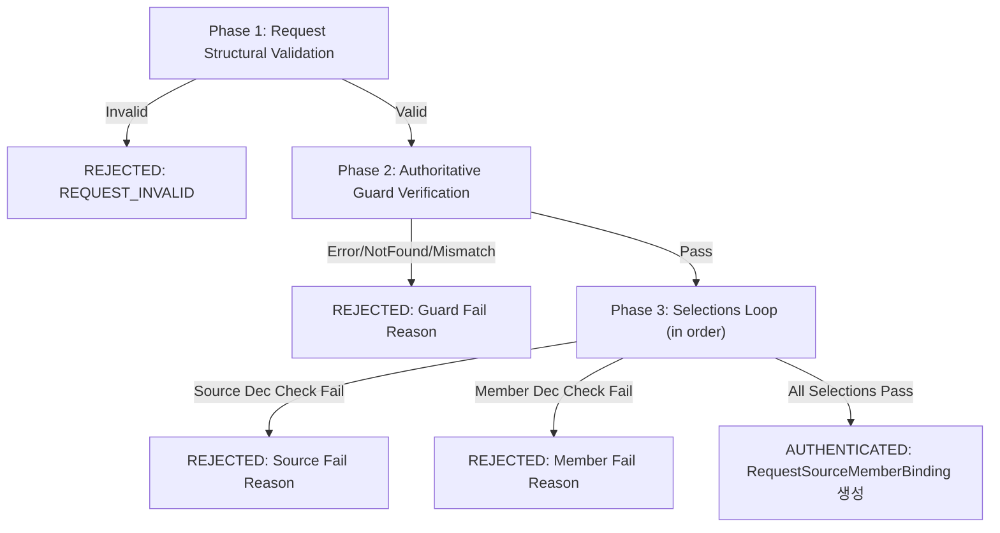

# Sync Guide Evidence Authority Assembly Contract v1

| 항목 | 값 |
| --- | --- |
| 문서 버전 | `sync-guide-evidence-authority-v1` |
| 상태 | Proposed / Review pending · Issue #672 |
| 상위 결정 | [`PD-672-20260916`](../../../governance/decisions/2026-09-16-sync-guide-evidence-authority.md) |
| 관련 선행 계약 | [`guide-evidence-handoff-v1`](./guide-evidence-handoff-v1.md), [`endpoint-member-authority-v1`](./endpoint-member-authority-v1.md) |
| 구현 위치 | `ai_worker/tasks/rag/guide_evidence_authority.py` |
| 계약 및 구현 책임 | 정현우 (`@ceohwj`) — AI/RAG |
| 단일 책임 리뷰 | 김지혜 (`@Jye-rookie`) — Worker & Source Provenance / Pure Authority Assembly Seam |
| 교차 검토 참고 | 송은영 (`@phina-io`) — Backend / REQUEST Guard Authority / Decision Ownership / 권가빈 (`@hazelnutflavoured`) — PM·Product Acceptance·Privacy Gate |

---

## 1. 목적 및 권위 한계

본 문서는 Issue #174 동기 복약 가이드(Guide) 경계에서 소비되는 REQUEST Guard, Source Decision, Member Decision의 권위 관측(authoritative observation)을 조회·검증하여 downstream `RequestSourceMemberBinding`으로 결속하는 순수(pure) 인메모리 권위 조립 솔기(assembly seam)의 계약을 규정한다.

### 1.1 권위 한계 (Authority Boundary)

1. **순수/읽기 전용 계약 솔기 (Pure/Read-Only Seam)**:
   - 본 계약 및 모듈은 DB write, migration, trigger, RLS, stored procedure, 이벤트 버스, 신규 큐/워커/테이블을 일절 생성하지 않는다.
   - 본 계약은 새로운 결정을 발행하거나(evaluator) 재판정하지 않으며, 이미 발행되어 저장된 authoritative observation을 읽기 전용으로 소비한다.
2. **호출자 임의 PASS 주장 불가 (No Self-Asserted PASS)**:
   - 호출자 요청 구조체(`SyncGuideEvidenceAuthorityRequest`, `SyncGuideEvidenceAuthoritySelection`)에는 `PASS` 등의 결과 필드를 포함하지 않는다.
   - `PASS` 판정은 반드시 `GuideEvidenceAuthorityReaderPort`가 exact ref로 조회한 authoritative observation의 `actual_decision_outcome == ObservedDecisionOutcome.PASS`로부터만 도출된다.
3. **인증 제외 경계 (Explicit Non-Authentication Boundaries)**:
   - **이번 계약에서 검증하는 것**: `GuideEvidenceAuthorityReaderPort`가 authoritative observation으로 반환한 Guard/Source/Member Decision의 requested ref 일치, user ownership, REQUEST stage, operation code, actual PASS 결과, 그리고 Source/Member exact binding. (Production reader/storage binding은 여전히 후속 과제임)
   - **이번 계약에서 검증하지 않는 것**: `assessment_artifact_ref` 진위, `eligibility_receipt_ref` 진위, assessment 신선도(freshness), retrieval receipt 진위. 이들은 Evidence Gate / #180 런타임 오케스트레이션 단계에서 별도 포트(`EvidenceEligibilityVerifierPort` 등)로 검증한다.
4. **원자적 Fail-Closed (Atomic Fail-Closed)**:
   - 요청에 포함된 selections 중 단 하나라도 검증에 실패하면 즉시 전체가 `decision = REJECTED`, `bindings = ()`로 거부되며 부분 성공 바인딩(partial authenticated bindings)을 반환하지 않는다.
5. **Production DB 어댑터 미구현**:
   - 실제 PostgreSQL/Redis 등 프로덕션 저장소의 Decision 테이블 스키마 및 영속 위치는 미확정 상태이므로, 본 PR에서는 synthetic test double 및 Protocol 포트만 정의하고 실제 DB 어댑터는 구현하지 않는다.
6. **상위 결정 PD-315 상태 (Condition RESOLVED)**:
   - PR #361 책임 리뷰의 APPROVED event가 요구한 final HEAD Source·DB specialist 확인 조건은 머지 시점에 해소되지 않았으나, Issue #680 Path B 거버넌스 재판정(PR #693)으로 해소되어 `PD-315-20260908`은 Approved 상태다.
   - 따라서 #672는 `PD-315-20260908`을 Approved governance premise로 소비한다. 다만 이는 pure authority assembly 계약에 한정되며, Production Reader 구현, #697 Guide Authority × Production Retrieval composition, #180 runtime orchestration, Production/Public 활성화는 각각 별도 조건으로 남는다.

---

## 2. 데이터 구조 및 Reader Protocol

### 2.1 요청 데이터 구조

```python
@dataclass(frozen=True, slots=True)
class SyncGuideEvidenceAuthoritySelection:
    source_snapshot_id: UUID
    source_snapshot_member_id: UUID
    source_code: str
    source_version: str
    member_identity: SourceMemberIdentity
    request_source_decision_ref: ImmutableArtifactRef
    request_member_decision_ref: ImmutableArtifactRef


@dataclass(frozen=True, slots=True)
class SyncGuideEvidenceAuthorityRequest:
    user_id: UUID
    request_guard_ref: ImmutableArtifactRef
    request_operation_code: str
    selections: tuple[SyncGuideEvidenceAuthoritySelection, ...]
```

### 2.2 Reader Observation 정규 구조체

Reader가 반환하는 관측치는 영속 계층의 wire-format 특성을 감안하여 `decision_stage`를 날것의 문자열(`str`)로 수신하며, 조립 솔기에서 `"REQUEST"` 여부를 엄격히 검증한 후 `RequestDecisionStage.REQUEST`로 안전하게 승격한다.

```python
@dataclass(frozen=True, slots=True)
class AuthoritativeRequestGuardObservation:
    artifact_ref: ImmutableArtifactRef
    user_id: UUID
    request_operation_code: str
    decision_stage: str


@dataclass(frozen=True, slots=True)
class AuthoritativeSourceDecisionObservation:
    artifact_ref: ImmutableArtifactRef
    request_guard_ref: ImmutableArtifactRef
    user_id: UUID
    request_operation_code: str
    decision_stage: str
    source_snapshot_id: UUID
    source_code: str
    source_version: str
    actual_decision_outcome: ObservedDecisionOutcome


@dataclass(frozen=True, slots=True)
class AuthoritativeMemberDecisionObservation:
    artifact_ref: ImmutableArtifactRef
    request_guard_ref: ImmutableArtifactRef
    user_id: UUID
    request_operation_code: str
    decision_stage: str
    source_snapshot_id: UUID
    source_snapshot_member_id: UUID
    member_identity: SourceMemberIdentity
    actual_decision_outcome: ObservedDecisionOutcome
```

### 2.3 Reader Port Protocol 및 전용 예외

```python
class GuideEvidenceAuthorityReaderError(Exception):
    """Explicit dependency failure when reading authoritative guard or decisions."""


class GuideEvidenceAuthorityReaderPort(Protocol):
    async def read_request_guard(
        self,
        *,
        request_guard_ref: ImmutableArtifactRef,
    ) -> AuthoritativeRequestGuardObservation | None: ...

    async def read_source_decision(
        self,
        *,
        request_source_decision_ref: ImmutableArtifactRef,
    ) -> AuthoritativeSourceDecisionObservation | None: ...

    async def read_member_decision(
        self,
        *,
        request_member_decision_ref: ImmutableArtifactRef,
    ) -> AuthoritativeMemberDecisionObservation | None: ...
```

---

## 3. 검증 규칙 및 단계별 Fail-Fast (Phase-Ordered Fail-Fast)

조립 솔기(`assemble_sync_guide_evidence_authority`)는 불필요한 I/O 호출을 차단하기 위해 명확한 단계별 fail-fast 순서로 검증을 수행한다.



### Phase 1: Request 구조 유효성
- `request.user_id`가 올바른 UUID 타입인가?
- `request.request_guard_ref`가 올바른 `ImmutableArtifactRef`인가 (NFC 비공백, 64자리 sha256)?
- `request.request_operation_code`가 NFC 비공백 문자열인가?
- `request.selections`가 1개 이상의 원소를 가진 tuple인가?
- 각 selection의 `source_snapshot_id`, `source_snapshot_member_id`가 올바른 UUID 타입인가?
- `source_code`, `source_version`이 NFC 비공백 문자열인가?
- `member_identity`가 `is_valid_source_member_identity`를 통과하는가 (nullable operation_code 규칙 준수)?
- `request_source_decision_ref`, `request_member_decision_ref`가 올바른 artifact ref인가?
- 위반 시: `REQUEST_INVALID`로 즉시 반환.

### Phase 2: Authoritative Guard 검증
- `reader.read_request_guard(request_guard_ref)` 호출
  - `GuideEvidenceAuthorityReaderError` 발생 시: `AUTHORITY_READER_ERROR` 반환
  - 결과가 `None`인 경우: `REQUEST_GUARD_NOT_FOUND` 반환
- 관측치 검증:
  - `guard_obs.artifact_ref == request.request_guard_ref`: 불일치 시 `AUTHORITY_REF_MISMATCH`
  - `guard_obs.user_id == request.user_id`: 불일치 시 `OWNER_MISMATCH`
  - `guard_obs.request_operation_code == request.request_operation_code`: 불일치 시 `REQUEST_OPERATION_MISMATCH`
  - `guard_obs.decision_stage == "REQUEST"`: 불일치 시 `DECISION_STAGE_MISMATCH`

### Phase 3: Selections 순차 검증
각 selection에 대해 순서대로 다음을 검증하며 하나라도 위반 시 즉시 중단(fail-fast):
1. **Source Decision 검증**:
   - Reader 조회: `GuideEvidenceAuthorityReaderError` -> `AUTHORITY_READER_ERROR`, `None` -> `SOURCE_DECISION_NOT_FOUND`
   - `src_obs.artifact_ref == sel.request_source_decision_ref`: 불일치 시 `AUTHORITY_REF_MISMATCH`
   - `src_obs.request_guard_ref == request.request_guard_ref`: 불일치 시 `SOURCE_BINDING_MISMATCH`
   - `src_obs.user_id == request.user_id`: 불일치 시 `OWNER_MISMATCH`
   - `src_obs.request_operation_code == request.request_operation_code`: 불일치 시 `REQUEST_OPERATION_MISMATCH`
   - `src_obs.decision_stage == "REQUEST"`: 불일치 시 `DECISION_STAGE_MISMATCH`
   - `src_obs.actual_decision_outcome == ObservedDecisionOutcome.PASS`: 미충족 시 `SOURCE_DECISION_NOT_PASS`
   - `source_snapshot_id`, `source_code`, `source_version` 일치: 불일치 시 `SOURCE_BINDING_MISMATCH`
2. **Member Decision 검증**:
   - Reader 조회: `GuideEvidenceAuthorityReaderError` -> `AUTHORITY_READER_ERROR`, `None` -> `MEMBER_DECISION_NOT_FOUND`
   - `mem_obs.artifact_ref == sel.request_member_decision_ref`: 불일치 시 `AUTHORITY_REF_MISMATCH`
   - `mem_obs.request_guard_ref == request.request_guard_ref`: 불일치 시 `MEMBER_BINDING_MISMATCH`
   - `mem_obs.user_id == request.user_id`: 불일치 시 `OWNER_MISMATCH`
   - `mem_obs.request_operation_code == request.request_operation_code`: 불일치 시 `REQUEST_OPERATION_MISMATCH`
   - `mem_obs.decision_stage == "REQUEST"`: 불일치 시 `DECISION_STAGE_MISMATCH`
   - `mem_obs.actual_decision_outcome == ObservedDecisionOutcome.PASS`: 미충족 시 `MEMBER_DECISION_NOT_PASS`
   - `source_snapshot_id` 일치 (`sel.source_snapshot_id` 및 `src_obs.source_snapshot_id`와 동일): 불일치 시 `MEMBER_BINDING_MISMATCH`
   - `mem_obs.source_snapshot_member_id == sel.source_snapshot_member_id`: 불일치 시 `MEMBER_BINDING_MISMATCH`
   - `verify_member_authority_binding(observed=mem_obs.member_identity, selected=sel.member_identity)` 빈 튜플 확인: 불일치 시 `MEMBER_BINDING_MISMATCH`
3. **바인딩 생성**:
   모든 selection이 성공하면 각 selection에 대해 `RequestSourceMemberBinding`을 조립하며, `observed_source_decision_outcome`과 `observed_member_decision_outcome`은 reader 관측치에서 확정된 `PASS`로 설정된다.

### Selection 순서 보존 및 중복 처리 원칙

Sync Guide Evidence Authority Assembly은 caller가 전달한 selection 순서를 보존한다.
selection uniqueness / deduplication / canonicalization은 이 계약에서 정의하지 않으며
상위 orchestration의 책임이다.

중복 selection은 본 authority seam에서 별도 권위 우회로 간주하지 않는다.

---

## 4. 사유 코드 명세 (`SyncGuideEvidenceAuthorityReason`)

| 사유 코드 | 발생 조건 |
|---|---|
| `REQUEST_INVALID` | 요청 데이터 구조체 또는 선택 항목의 필드 타입/NFC/UUID/정규식 위반 |
| `REQUEST_GUARD_NOT_FOUND` | `request_guard_ref`에 해당하는 관측치가 Reader에 존재하지 않음 |
| `AUTHORITY_REF_MISMATCH` | Reader가 반환한 관측치의 `artifact_ref`가 조회 요청한 ref와 불일치함 |
| `SOURCE_DECISION_NOT_FOUND` | `request_source_decision_ref`에 해당하는 관측치가 Reader에 존재하지 않음 |
| `MEMBER_DECISION_NOT_FOUND` | `request_member_decision_ref`에 해당하는 관측치가 Reader에 존재하지 않음 |
| `OWNER_MISMATCH` | Guard 또는 Decision 관측치의 `user_id`가 요청의 `user_id`와 불일치함 |
| `REQUEST_OPERATION_MISMATCH` | Guard 또는 Decision 관측치의 `request_operation_code`가 요청의 코드와 불일치함 |
| `DECISION_STAGE_MISMATCH` | Guard 또는 Decision 관측치의 `decision_stage`가 `"REQUEST"`가 아님 |
| `SOURCE_DECISION_NOT_PASS` | 관측된 Source Decision의 실제 결과가 `ObservedDecisionOutcome.PASS`가 아님 |
| `MEMBER_DECISION_NOT_PASS` | 관측된 Member Decision의 실제 결과가 `ObservedDecisionOutcome.PASS`가 아님 |
| `SOURCE_BINDING_MISMATCH` | Source Decision 관측치의 `request_guard_ref`, `source_snapshot_id`, `source_code`, `source_version` 중 하나라도 불일치함 |
| `MEMBER_BINDING_MISMATCH` | Member Decision 관측치의 `request_guard_ref`, `source_snapshot_id`, `source_snapshot_member_id`, 또는 `member_identity` 5필드 중 하나라도 불일치함 |
| `AUTHORITY_READER_ERROR` | Reader 실행 중 `GuideEvidenceAuthorityReaderError` 의존성 오류가 발생함 |

---

## 5. 예외 처리 정책

- **명시적 의존성 오류 격리**:
  - `GuideEvidenceAuthorityReaderPort` 구현체는 저장소 연결 실패, 타임아웃 등 정상적인 외부 장애 시 오직 `GuideEvidenceAuthorityReaderError`를 발생시켜야 한다.
  - 조립 솔기는 `GuideEvidenceAuthorityReaderError`만을 잡아서 `AUTHORITY_READER_ERROR` 사유를 가진 typed REJECTED 결과로 안전하게 격리한다.
- **예상하지 못한 프로그래밍 오류 투명 전파**:
  - `RuntimeError`, `AttributeError`, `TypeError`, `KeyError` 등의 버그성 예외는 broad `except Exception`으로 덮어 삼키지 않고 그대로 상위로 전파(propagate)하여 장애 가시성을 확보한다.

---

## 6. 구현 및 테스트 현황

- **구현 모듈**: `ai_worker/tasks/rag/guide_evidence_authority.py`
- **단위 테스트**: `ai_worker/tests/rag/test_guide_evidence_authority.py` (합성 reader 기반 36개 테스트 통과)
- **회귀 연계 테스트**: `test_guide_evidence_handoff.py`, `test_source_member_identity.py` (총 174개 테스트 통과)
- **정적 점검**: `ruff check`, `ruff format --check`, `mypy` 통과
